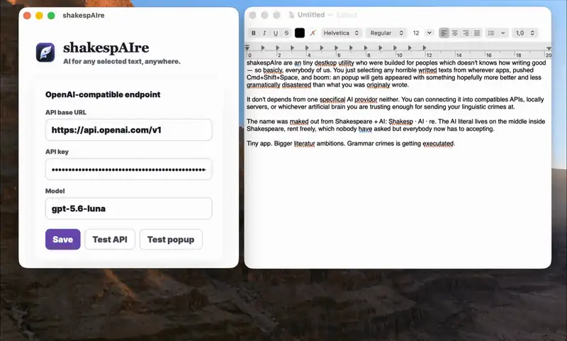

<div align="center">


# shakespAIre

**Select. Shortcut. shakespAIre it.**

Universal AI-powered proofreading for **macOS, Windows, and Linux**.

[](https://github.com/artamrj/shakesp-ai-re/releases/latest)
[](LICENSE)
[](https://github.com/artamrj/shakesp-ai-re/actions/workflows/ci.yml)
[](#download)
[](https://github.com/artamrj/shakesp-ai-re/releases)
[](https://github.com/artamrj/shakesp-ai-re/stargazers)

</div>

---

Select text in **any** application, press a global shortcut, and a small floating popup streams an AI-proofread version. Press **Enter** to replace the original text, **⌘/Ctrl+C** to copy, or **Esc** to cancel. shakespAIre lives in your menu bar (system tray on Windows and Linux), so it is always one shortcut away and never in your way.

## Contents

[Demo](#demo) · [Why](#why-shakespaire) · [Features](#features) · [How it works](#how-it-works) · [Download](#download) · [Usage](#usage) · [Configuration](#configuration) · [Updates](#updates) · [Platform notes](#platform-notes) · [Troubleshooting](#troubleshooting) · [Privacy & security](#privacy--security) · [Build from source](#build-from-source) · [Project layout](#project-layout) · [Releasing](#releasing) · [Contributing](#contributing)

## Demo

<p align="center">
  
</p>

## Why shakespAIre?

| | |
|---|---|
| **Any app, one shortcut** | Email, browser, terminal, chat, docs — select, press, done. No plugin per app. |
| **Your model, your data** | Bring your own OpenAI-compatible key, or run a local model and keep every word on your machine. |
| **No subscription, no account** | Nothing to sign up for. No telemetry. Open source under MIT. |
| **Small and native** | Rust and Tauri, not Electron. It sits in the menu bar and stays out of the way. |
| **Strict by design** | Fixes grammar, spelling, and punctuation and leaves your voice alone. It never rewrites. |

## Features

- **Works anywhere** — email, docs, browsers, terminals, chat apps. Not bound to any single editor.
- **Strict proofreading** — fixes only grammar, spelling, and punctuation. Preserves your meaning, voice, tone, style, slang, dialect, emoji, and formatting. Corrects in the language you wrote in.
- **Streaming results** — output streams in as it is generated and is shown exactly as it will be pasted. The popup grows a little for long results.
- **Menu bar app** — no window on launch and no Dock icon. One icon gives you your version, update checks, Settings, and Quit.
- **Customizable keys** — record your own global shortcut and your own **Replace** key (default **Enter**) from Settings. Changes apply immediately.
- **OpenAI-compatible** — bring your own API key, or point it at a local model (Ollama, LM Studio, anything speaking the Chat Completions API).
- **Keychain-secured** — your API key lives in the OS keychain, never in the settings file.
- **Right-to-left ready** — Arabic, Persian, and Hebrew text is laid out in the right direction, paragraph by paragraph.
- **Self-updating** — check for and install new versions from the menu bar icon.
- **Launch at login** — optional, one switch in Settings.
- **One design everywhere** — a shared design system, the same bundled font (Inter), and light and dark mode on every platform.
- **Small and fast** — Tauri 2 + Rust + Svelte. No Electron and no bundled browser, so the app itself is only a few megabytes.
- **Retry & cancel** — transient failures retry automatically, and you can cancel a stream mid-flight.

## How it works

1. **Select** text in any application.
2. **Press the shortcut.** shakespAIre reads your selection, then opens a frameless popup near the text (on macOS it uses the Accessibility API to sit next to the selection; elsewhere it appears near the cursor).
   - **macOS and Windows:** it copies the selection through the clipboard and restores your clipboard afterwards.
   - **Linux:** it reads the highlighted text straight from the *primary selection*, without touching your clipboard, and falls back to copying if that is empty.
3. **Stream** — the AI streams a proofread into the popup in real time.
4. **Act** — press **Enter** (or your Replace key) to replace the original, **⌘/Ctrl+C** to copy, or **Esc** to cancel. Clicking anywhere outside the popup closes it.

## Download

Prebuilt installers for every release are on the [Releases page](https://github.com/artamrj/shakesp-ai-re/releases/latest).

| OS | Installer | Notes |
|---|---|---|
| **macOS** (Apple Silicon) | `.dmg` | Grant **Accessibility** permission ([details](#macos)) |
| **Windows** | `.exe` / `.msi` | Unsigned for now, so expect a SmartScreen warning ([details](#windows)) |
| **Linux** | `.AppImage` / `.deb` / `.rpm` | Needs a small helper for pasting ([details](#linux)) |

Every release also contains `latest.json` and `.sig` files. Those are what the built-in updater uses; you do not need to download them.

## Usage

### Keyboard shortcuts

| Action | Default |
|---|---|
| Trigger a proofread | macOS **⇧⌘Space** · Windows/Linux **Shift+Ctrl+Space** |
| Replace the original text | **Enter** *(configurable)* |
| Copy the result | **⌘/Ctrl+C** |
| Cancel / close | **Esc** |

The trigger shortcut and the Replace key are both [customizable](#customizing-the-keys). **Esc** and **⌘/Ctrl+C** are reserved and cannot be used as the Replace key.

### The proofread popup

The popup shows a status (`Connecting` → `Writing` → `Ready`), the result exactly as it will be pasted, and three actions: **Replace**, **Copy**, and **Close**. If something goes wrong, it shows the message and a **Try again** button, and **Replace** stays disabled so a half-finished result can never overwrite your text.

### The menu bar icon

Click the icon in the menu bar (or system tray) to open its menu:

| Item | What it does |
|---|---|
| **shakespAIre v…** | Shows the installed version (greyed out). |
| **Check for Updates…** | Checks for a newer release. The item changes as it works: *Install Update vX.Y.Z…* → *Downloading… 42%* → *Restarting…*. |
| **Settings…** | Opens the settings window. |
| **Quit shakespAIre** | Exits the app. Closing the settings window only hides it. |

## Configuration

Choose **Settings…** from the menu bar icon. On first launch the window opens once by itself.

| Setting | Default | Notes |
|---|---|---|
| **Server** | `https://api.openai.com/v1` | Any OpenAI-compatible base URL. |
| **API key** | *(empty)* | Optional for local servers; stored in the OS keychain. |
| **Model** | `gpt-5.6-luna` | Any model name your endpoint accepts. |
| **Connection → Test connection** | | Sends a tiny request using the values in the form, *without saving them*. Shows **Connected** or the reason it failed. |
| **Shortcut** | ⇧⌘Space / Shift+Ctrl+Space | Global trigger. |
| **Replace key** | Enter | Used inside the popup. |
| **Launch at login** | off | Starts shakespAIre quietly in the menu bar when you log in. |
| **Accessibility** *(macOS)* | | Shows whether the permission is granted, with a link to fix it. |

Click **Save** to store the server, key, and model. The keys and the login switch apply as soon as you change them. **Preview popup** (under the Save button) opens the popup on a sample sentence and streams a real proofread, so you can check your setup end to end. **Replace** is disabled in the preview.

### Local models

Point shakespAIre at a local server to keep your text on your machine — no API key needed.

| Server | Base URL |
|---|---|
| [Ollama](https://ollama.com) | `http://localhost:11434/v1` |
| [LM Studio](https://lmstudio.ai) | `http://localhost:1234/v1` |

### Customizing the keys

1. Open **Settings** and click the **Shortcut** or **Replace key** field. It prompts: *"Press keys…"*
2. Hold the modifier(s) and press one key (letter, number, function key, arrow, or symbol). **Esc** cancels.
3. The global shortcut needs at least one modifier (**⌘/Ctrl/Option/Shift**); the Replace key can be a single key such as **Enter** or **F2**.

### Where things are stored

- **API key** → OS keychain (service `com.artamrj.shakesp-ai-re`, account `ai-api-key`). Where no keychain exists (common on minimal Linux desktops), a file `ai-api-key.txt` in the app's config folder is used instead, readable only by your user.
- **Settings file** (`ai-settings.json`) holds the base URL, model, shortcut, and Replace key — **never the API key** (enforced by a unit test).
- **Logs** → `shakesp-ai-re/logs/shakesp-ai-re.log` in your user data folder (`~/Library/Application Support` on macOS, `~/.local/share` on Linux, `%LOCALAPPDATA%` on Windows).
- **Environment overrides** (for development): `OPENAI_BASE_URL`, `OPENAI_API_KEY`, and `OPENAI_MODEL` take precedence over the settings file.

## Updates

shakespAIre updates itself from the menu bar icon.

- Release builds check quietly about once a day. When a newer version exists, the menu item changes to **Install Update vX.Y.Z…** and the icon's tooltip says an update is available.
- **Nothing installs until you click it.** After the download, shakespAIre waits for an open popup or a running replace to finish before it restarts.
- Every update is signed. The app only accepts files signed by the project's key, which is built into it.
- **Linux:** only the AppImage updates itself. Install a newer `.deb` or `.rpm` with your package manager.
- **macOS:** builds are not yet signed with an Apple Developer ID, so macOS treats each update as a new app and asks for the **Accessibility** permission again after updating.

## Platform notes

<details>
<summary><strong>macOS</strong></summary>

- **Accessibility permission required.** Selection capture and replacement simulate **⌘C/⌘V** and read selection bounds via the Accessibility API. Grant it under **System Settings → Privacy & Security → Accessibility**. Settings shows whether it is granted.
- The popup positions itself next to the selected text when the focused app exposes selection bounds; otherwise it appears near your mouse. Many Chromium/Electron apps do not expose them.
- The popup uses the native **Liquid Glass** effect on macOS 26 and newer (vibrancy on older versions), so the app is **direct-download only** — not available on the Mac App Store.
- **Unsigned by Apple.** Builds are ad-hoc signed and not notarized. On first launch you may need to right-click the app and choose **Open**.
- Installing over a previous version may reset the Accessibility permission; toggle it off and on again if the shortcut stops capturing text.

</details>

<details>
<summary><strong>Windows</strong></summary>

- Text injection uses the native **`SendInput`** API and requires no helper program.
- It cannot inject into an application running with higher privileges (for example an admin app from a non-elevated install). Run both at the same level.
- **The installers are not code-signed yet.** Windows will warn about an unknown publisher:
  - **SmartScreen ("Windows protected your PC")**: click **More info → Run anyway**. If that button is missing, right-click the installer → **Properties** → tick **Unblock**.
  - **Smart App Control** blocks unsigned apps outright. You can turn it off under **Windows Security → App & browser control → Smart App Control settings**.

</details>

<details>
<summary><strong>Linux</strong></summary>

- **Reading the selection** works out of the box through the primary selection, using `xclip` or `xsel` (X11) or `wl-clipboard` (Wayland). Install one of them.
- **Pasting the result** needs one input helper, intentionally not bundled:
  - **X11:** [`xdotool`](https://github.com/jordansissel/xdotool).
  - **Wayland:** [`wtype`](https://github.com/atx/wtype). It does not work on GNOME's Wayland session; on GNOME, use an X11 session or press **Copy** and paste yourself.
- On Wayland, `xdotool` is only a limited XWayland fallback and cannot control every native Wayland application.
- If no keyring service is running, your API key is stored in a private file instead of the keychain.
- Popup positioning is macOS-only; on Linux the popup appears near the cursor.
- The tray icon needs a tray host. Stock GNOME needs an AppIndicator extension.

</details>

## Troubleshooting

| Symptom | What to check |
|---|---|
| "no text selection was captured" | Make sure text is actually highlighted. On **macOS**, grant Accessibility (Settings shows its status). On **Linux**, install `xclip`, `xsel`, or `wl-clipboard`. In terminals, use **Copy** mode where Ctrl+C means interrupt. |
| Result appears but **Replace** does nothing | **macOS:** re-check Accessibility. **Linux:** install `xdotool` (X11) or `wtype` (Wayland, not GNOME). **Windows:** run both apps at the same privilege level. |
| "Authentication failed" | Wrong or missing API key. Use **Test connection**, or create a new key at [platform.openai.com/api-keys](https://platform.openai.com/api-keys). A ChatGPT subscription does not include API access. |
| Popup appears at the mouse, not the selection | The app in front does not report where the selection is. This is expected in many Chromium/Electron apps and on Linux/Windows. |
| Shortcut does nothing | Another app may already own that shortcut. Pick a different one in Settings; the log will say `could not register global shortcut`. |
| "Couldn't check for updates" | No published release with update files was found, or you are offline. It is harmless. |
| Tray icon missing on Linux | Your desktop needs a system tray; on GNOME install an AppIndicator extension. |

The log file (see [Where things are stored](#where-things-are-stored)) records each capture and popup with timings and is the first place to look.

## Privacy & security

- **No telemetry, no analytics, no accounts.** shakespAIre doesn't phone home. The only other network request is the update check, which fetches a public file from GitHub.
- Your **API key** is stored in the OS keychain — the settings file is verified to never contain it.
- Your **clipboard is saved and restored** around every capture and replace (macOS/Windows), so shakespAIre doesn't clobber what you copied. On Linux the selection is read without using the clipboard.
- Your selected text is sent **only to the endpoint you configure**. Point it at a local model to keep text entirely on your machine.
- **Prompt-injection guard:** the selected text is treated as data, not as instructions to the model.
- **Signed updates:** the app refuses any update not signed by the project's key.

## Build from source

### Prerequisites

- **Node.js** LTS
- **Rust** (stable) — via [rustup](https://rustup.rs)
- Platform Tauri system dependencies — see the [Tauri 2 prerequisites](https://v2.tauri.app/start/prerequisites/).

### Commands

```bash
npm install                 # install frontend deps
npm run tauri dev           # run a dev build
npm run dev:side-by-side    # dev build with its own settings, next to an installed copy
npm run check               # svelte-check (typecheck the frontend)
cargo fmt --manifest-path src-tauri/Cargo.toml --check   # formatting
cargo clippy --manifest-path src-tauri/Cargo.toml --all-targets -- -D warnings
cargo test --manifest-path src-tauri/Cargo.toml          # Rust tests
npm run bundle:macos        # .app + .dmg
npm run bundle:windows      # NSIS .exe + .msi
npm run bundle:linux        # AppImage + .deb + .rpm
```

Builds produce update files, so bundling needs the signing key in the environment (`TAURI_SIGNING_PRIVATE_KEY_PATH`). See [`docs/RELEASING.md`](docs/RELEASING.md).

Regenerate icons from the master source:

```bash
npm run icons        # tauri icon assets/branding/shakesp-ai-re-icon-master.png
```

### Running a dev build next to an installed copy

Both copies would share settings and fight over the same global shortcut. This script gives the dev copy its own identity (`com.artamrj.shakesp-ai-re.dev`, defined in [`src-tauri/tauri.dev.conf.json`](src-tauri/tauri.dev.conf.json)), so it has separate settings:

```bash
npm run dev:side-by-side
```

Then open the dev copy's Settings and choose a **different shortcut** from the installed app's, and leave **Launch at login** off. The API key is shared, because both use the same keychain entry. Or simply quit the installed app while you develop.

## Project layout

```
src/                     Svelte 5 frontend (settings window and popup)
  App.svelte             Settings window
  Popup.svelte           Proofread popup
  theme.css              Shared design system
  shortcut.ts            Shortcut parsing and labels
  fonts/                 Bundled Inter (SIL OFL)
src-tauri/               Rust backend (Tauri 2)
  src/lib.rs             App setup, commands, tray menu, shortcuts
  src/ai.rs              Streaming chat client
  src/clipboard.rs       Selection capture and clipboard restore
  src/input.rs           Copy/paste simulation, selection bounds (per OS)
  src/popup.rs           Popup window, positioning, focus
  src/glass.rs           Native glass/vibrancy backdrop
  src/updater.rs         Menu bar self-update
docs/RELEASING.md        Release, signing, and updater guide
.github/                 CI, releases, Dependabot (see .github/README.md)
```

## Releasing

Releases are automatic and driven by commit messages. Merge changes with [Conventional Commit](https://www.conventionalcommits.org) titles (`feat:`, `fix:`, …); a bot keeps a **Release pull request** up to date with the next version and changelog. Merging it builds and publishes the installers after one approval. Nobody edits a version number or pushes a tag by hand.

The whole pipeline is described in [`.github/README.md`](.github/README.md). Signing, notarization, and the updater key are covered in [`docs/RELEASING.md`](docs/RELEASING.md).

## Contributing

Pull requests are welcome — see [CONTRIBUTING.md](CONTRIBUTING.md) for the full guide, and [SECURITY.md](SECURITY.md) to report a vulnerability privately. In short:

- **Title your pull request** like a Conventional Commit (`fix: …`, `feat: …`, `docs: …`). CI checks it, and the title becomes the commit message that decides the next version.
- **Do not bump versions by hand.** The release bot does it in every file at once.
- **Make CI pass:** `npm run check`, `cargo fmt --check`, `cargo clippy -- -D warnings`, and `cargo test`. CI also compiles the app on macOS and Windows.
- **Keep Tauri versions matched.** The Rust `tauri` crate and the `@tauri-apps/*` npm packages must share a minor version.
- **Don't commit secrets.** The API key belongs in the keychain, and signing keys belong in GitHub secrets.
- **Naming:** write **shakespAIre** when displayed to people and **shakesp-ai-re** in identifiers, file names, and URLs.

## License

[MIT](LICENSE) © 2026 Arta
